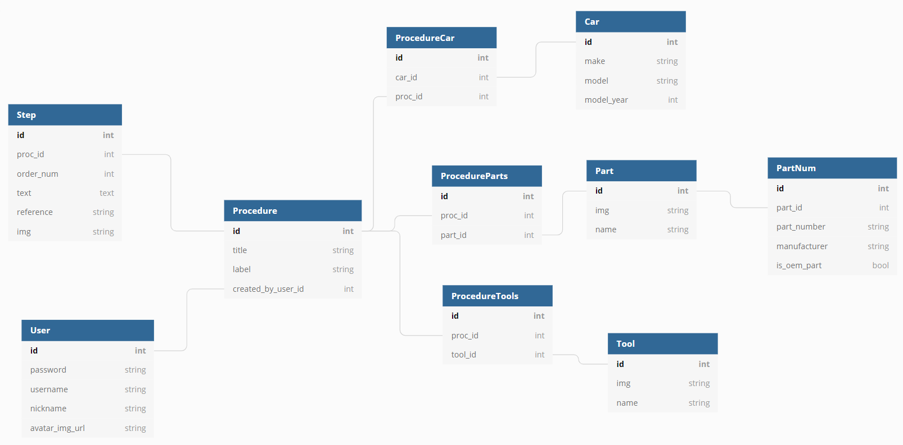

# :toolbox: Shop Cat

A collaborative wiki for vehicle repair.  
This app allows users to create individual pages for different procedures, with step-by-step instructions. Pages are linked by keyword and moderated by the community.  
The app is meant to be a better-moderated, more structured alternative to traditional vehicle forum writeups and videos. It also provides room for flexibility and collaborative oversight.

### :hammer_and_wrench: Technologies Required

- postgreSQL, Python, Flask/SQLAlchemy, JavaScript, jQuery/Ajax, HTML, CSS/Bootstrap
- YouTube iFrame Player API: https://developers.google.com/youtube/v3
- BeautifulSoup 4: https://www.crummy.com/software/BeautifulSoup/bs4/doc/

### :hammer_and_wrench: Data

**Procedures are the central building blocks of Shop Cat.**

Procedures consist of Cars, Parts, Tools, and Steps.
A Procedure can apply to multiple Cars, and multiple Procedures can be written about a Car. (many-many)  
A Procedure can require multiple Parts, and Parts can be used in multiple Procedures. (many-many)  
A Procedure can require multiple Tools, and Tools can be used in multiple Procedures. (many-many)  
A Procedure consists of multiple Steps, but a Step can only exist in a specific Procedure. (one-many)  
	***special case (to be implemented): when a Procedure is also a Step (i.e. remove wheels, disconnect battery...)***  
A Part can have multiple Part-Numbers, but a Part-Number can only describe one Part (one-many)

**Users are connected to the procedures that they write in Shop Cat.**   
- Current implementation: only the user who wrote the proceudre is tied to it.
- Users can edit many things, and each thing can be edited by many different Users, but no changes are tracked.
- Future implementation: Users will be connected to all the things they change via their key in a contribution history.

### :hammer_and_wrench: Roadmap

#### MVP

- [x] User can create a new page to outline a procedure.
- [x] User can add a fixed number of required tools and parts, as well as text-based step-by-step directions.
- [x] User has the option to link to a photo relevant to the procedure.
- [x] Text inputs will feed into a formatted display that can be read easily. 
- [x] Any new procedures or vehicles/tools/parts created when a procedure is written are automatically added to the database. 

#### 2.0

- [x] Allow user logins.
- [x] Allow user to add any number of required tools and parts to their procedure.
- [x] Allow user to add discrete steps to their procedure.
- [x] User will be able to link to references to specific steps in their procedures.
    - [x] References to YouTube lead to embedded video players on procedure page.

#### 3.0

- [x] Allow users to add, remove, or edit steps after a procedure is generated for the first time.
- [x] Allow users to add, remove, or edit tools/part lists after a procedure is generated for the first time.
- [x] Allow users to add or remove cars to a procedure after it is generated.

#### 4.0
- [ ] Adapt site to use React.
- [ ] Allow users to flag procedures that are unclear.
- [ ] All edits made by a certain user (to a procedure or info page) will be tracked in contribution history.
- [ ] Link to the Wikipedia API to get general information about the vehicle on the page.
